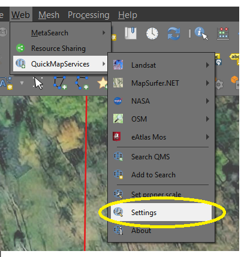
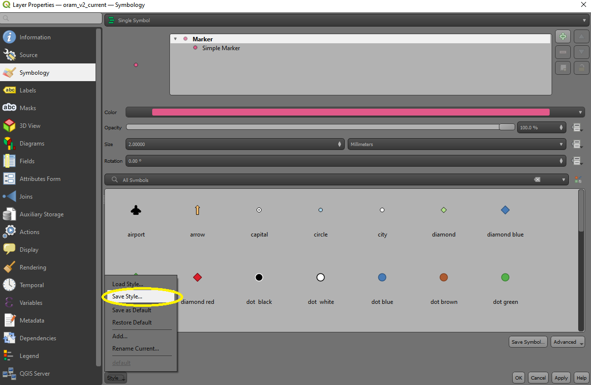
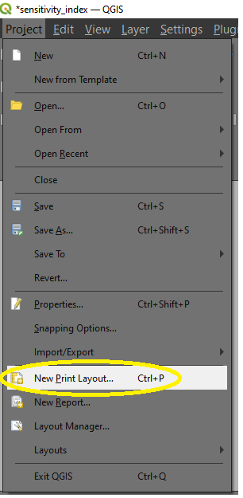
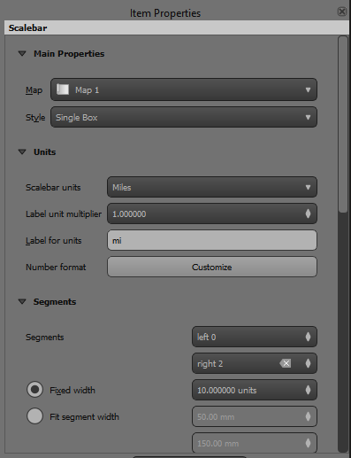
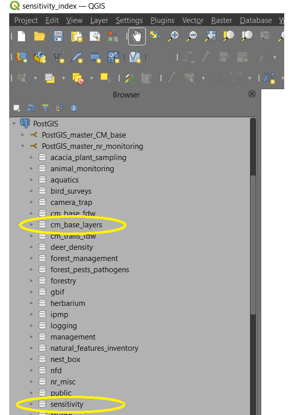

```{r setup, include=FALSE}
knitr::opts_chunk$set(echo = TRUE)

```

The following document is based on notes taken by Jennifer A. Hillmer of Cleveland Metroparks during John Reinier's March 23, 2022 GIS workshop. Although originally recorded in OneNote, Nathan W. Byer re-formatted these notes as an R Markdown file from late May-early June 2022. **These notes are intended to be part of a living document - so recommendations and suggestions are welcome!**

# Working with QGIS and PostGIS

* When we talk about **Geographic Information System** software, one often thinks about Esri's ArcGIS family of applications. Although ArcGIS is certainly the most popular GIS platform, it is by no means the cheapest. 
* That is where **quantum GIS (QGIS) ** comes in. QGIS is an open source, free GIS platform that has many of the same utilities as other, more costly platforms. 
* Below, we will provide some guidance on how to use QGIS for basic GIS operations.

## Where do I find GIS data?

* Before diving into GIS applications more fully, you will need access to GIS *layers* - basically, spatially-referenced datasets.
* These layers are grouped into two broad classes:
** *Vector* layers - represented by points, lines, and polygons (.shp, .gpx, .kml)
** *Raster* layers - represented by grids of pixels (.tif, .asc, .rst as common extensions)
* Here at Cleveland Metroparks, GIS layers can be found in multiple locations: 

1. Cleveland Metroparks share drives (wcsc-srv-01\Groups\NaturalResources\GIS_NR_layers\) 

2. GIS Aerials drive (GIS Imagery (W:\))

3. Aerials maintained by GIS staff (\\cmac-fs02\GIS\IMAGERY\AERIALS): this location can be mapped to whatever drive you would live, but you will need permission from ITS to access these folders.

4. PostGIS layers in the NR_monitoring database schemas, including cm_base_layers and sensitivity 

5. Local (WC server) shapefiles, particularly contours. (These are shapefiles, not database tables.) 

6. You may have your own local project layers. Remember, these are generally not available to other users unless you ask John or Nathan to upload them for you.  

7. Some background layers, such as aerial photos (raster data) or general topographic maps, can be brought in from external sources. These might not be "leaf-off" aerial photos, if that matters to you. 

## How do I connect to the database? 

Prior to this tutorial, please ask either John or Nathan to make sure your QGIS instance has the proper connection settings for the PostGIS database. This will involve right-clicking on the PostGIS icon (  ), creating a new connection, and adding in some relevant information about the database. You will also need to set up a QGIS-specific master authentication password. Keep in mind that this is going to be specific to **your current installation of QGIS** - it will not carry forward to different machines, unlike your PostGIS login information! 

You should ultimately wind up with a similar setup for this new connection to this:


```{r, echo = FALSE,fig.align="center",out.width="50%"}


```


You should now be able to access all layers in the NR_monitoring database. 

If you were to save your current project - and that project has layers from the database - when you boot back up, you may need to re-enter your credentials. This will likely look like the following popup box:

```{r, echo = FALSE,warning=FALSE,message=FALSE,fig.align="center",out.width="50%"}


```


## How do I add background layers? 

There are 2 ways to add background layers to your project. 

### Option #1 (preferred) - Add from browser window 

1. If your browser window is not visible, go to View  > Panels > Browser to turn it on. This will be an easy way to view background layers available to your project.

```{r, echo = FALSE,fig.align="center",out.width="50%"}

knitr::include_graphics("./images/part1/image2.png")

```


2. Open your PostGIS connection . Click the dropdown and you should have a connection that says something like "NR_monitoring".

```{r, echo = FALSE,fig.align="center",out.width="50%"}


```

3. Click the NR_monitoring dropdown and you will see a list of schemas (your list will likely be shorter than what is shown below).  cm_base_layers is an important one and will include many useful background layers. 

```{r, echo = FALSE,fig.align="center",out.width="50%"}


```


4. When you drop down a schema you'll see all the layers available to you: 

```{r, echo = FALSE,fig.align="center",out.width="50%"}


```
5. You can then right-click to add a layer to the project OR drag drop it into your layer list: 

```{r, echo = FALSE,fig.align="center",out.width="50%"}


```


<div class="alert alert-success">
  <strong>Regarding layer stylings:</strong> Layers that John R. has created default styling for should be styled automatically when you load them.  If there is no default style, it will be styled randomly and you'll have to modify the styling however you wish.  The "index_of_nr_value" and "natural_features" (point layer) are two examples of layers that should have default styling.  If they do not load with nice styling (I.e., categorized with different colors), please let John R. know.   

</div>

### Option #2 (a little clunkier) - Add from "Layer" tab 

1. Click the "Layer" tab at the top of your project.  Hover over "Add Layer" and then click "Add PostGIS Layers..." 


```{r, echo = FALSE,fig.align="center",out.width="50%"}


```


2. Next you'll see a PostgreSQL connection window pop up.  Make sure your connection says something like "NR_monitoring" and then click "Connect."  Just like with Option #1, you'll then see several schemas that contain layers:

```{r, echo = FALSE,fig.align="center",out.width="50%"}


```


3. Dropping down a schema will show layers available to you within that schema:

```{r, echo = FALSE,fig.align="center",out.width="50%"}


```


4. This is where Option #2 gets a little tricky.  Ideally, you would highlight any layer you want to add by clicking it once, and then you would click "Add" in the lower right of the window: 

```{r, echo = FALSE,fig.align="center",out.width="50%"}


```

Unfortunately, this option is more sensitive to how individual layer properties are set, which can lead to frustrating errors when trying to load layers.  This is why we recommend using Option #1.  If you prefer Option #2 for some reason, and you get errors, call John R. for assistance. 

## Are there any easy ways to get in GIS imagery?

* Quick Map Services (QMS) is a QGIS plugin that provides access to externally-maintained background layers that many users will find helpful.  It is particularly useful as an easy source of high-resolution aerial photos that can be used for map-making and general viewing.  

### If you have QMS installed: 

You should see QMS buttons, similar to those shown below.  The QMS search feature is important and is show in the middle. 

```{r, echo = FALSE,fig.align="center",out.width="50%"}


```


### If you don't see the QMS icons in your toolbars:

* This means that the plugin is not installed, so you will need to install the QMS plugin. 

1. First make sure your Web Toolbar is visible by clicking the "View" tab at the top of your project, hovering over "Toolbars", and then making sure that "Web Toolbars" is underlined. 

```{r, echo = FALSE,fig.align="center",out.width="50%"}


```


2. Next, click the "Plugins" tab and select "Manage and Install Plugins":


```{r, echo = FALSE,fig.align="center",out.width="50%"}


```

 
3. You'll then see the Plugin management window pop up:

```{r, echo = FALSE,fig.align="center",out.width="50%"}

knitr::include_graphics("./images/part1/image15.png")

```


<div class="alert alert-success">
  <strong>The plugin menu:</strong> While we will not go into detail about the plugin menu, it is worth familiarizing yourself with how this menu is arranged. On the left, you see the list of all plugins available for your QGIS, both installed and available for download. Some plugins come with your QGIS installation while most of them are made available via the plugin repositories. 

You can temporarily enable or disable a plugin. To enable or disable a plugin, click its checkbox or double click its name. Plugins showing in red are not loaded because there is a problem.  Click on the plugin name to see more details, or to reinstall or uninstall this plugin.
</div>


4. In the Search Bar, type "QMS" :

```{r, echo = FALSE,fig.align="center",out.width="50%"}


```


5. You should then see an "Install" option at the bottom right of the Plugins window.  Click "Install".

6. Once installed, and assuming your Web Toolbar is turned on (as described above), you should see the QMS icons in your toolbar. 

7. By default, the list of available basemaps is quite limited. Thus, we recommend installing the contributed map pack. You can do so by navigating to the settings for the QMS plugin (Web-->QuickMapServices-->Settings) 

```{r, echo = FALSE,fig.align="center",out.width="50%"}



```

8. Once you are there, You should see tabs labelled "General", "Tiles", "Add/Edit/Remove", "Visibility", and "More Services". Navigate to "More Services" and click on "Get Contributed Pack".  

```{r, echo = FALSE,fig.align="center",out.width="50%"}


```


9. You can now select from a number of imagery layers for your mapping needs. There are two ways to do this. First, you can click on the QMS icon with the magnifying glass and use this to search for your desired basemaps. The most useful and familiar will likely be the ESRI products, such as the ESRI satellite layer: 

```{r, echo = FALSE,fig.align="center",out.width="50%"}


```


10. You can also use the drop-down menu under Web --> QuickMapServices to browse available images.

```{r, echo = FALSE,fig.align="center",out.width="50%"}


```
 

<div class="alert alert-info">
  <strong>Contours:</strong> Getting current, complete (esp. 2 foot)  contours is still a work in progress.  At present, the best single source for contours is probably the "contours_simp_3734" shapefile found at \\wcsc-srv-01\GROUPS\NaturalResources\GIS_NR_layers\shapefiles\contours_simp_3734.shp  

This layer provides 2 ft. contours within park boundaries (does not include newer acquisitions) and 10 ft. contours for areas outside the park (adjacent counties). 
</div>


# How do I customize my GIS maps and layers?

* Once you have your layers in QGIS, you likely will want to customize the appearance of these layers as well - and create a tidy, interpretable map to summarize your efforts.

* If styles are set as default in the database, the layers will load with the set style. Otherwise, the styling is random and uncategorized. The example below shows the headwater stream assessment point layer with the default styling saved in the database. 

```{r, echo = FALSE,fig.align="center",out.width="50%"}


```

## How do I access other saved layer styles?

1. Double (or right) click to get to Layer Properties:

```{r, echo = FALSE,fig.align="center",out.width="50%"}


```

2. Go to Styles > Load Style...:

```{r, echo = FALSE,fig.align="center",out.width="50%"}


```

3. Select "From Database (postgres). You will then see styles specifically associated with the layer and then other styles stored in the database. Some of these are just draft or project-specific styles that may not be useful.

```{r, echo = FALSE,fig.align="center",out.width="50%"}


```

## How do I manually style a layer?

1. Go to Layer Properties (as described above) and click "Symbology".

```{r, echo = FALSE,fig.align="center",out.width="50%"}


```


<div class="alert alert-info">
  <strong>As a quick note on style options:</strong> There are many styling options here.  Detailing them all is beyond the scope of this tutorial!  You are encouraged to explore styling options on your own layers. 
</div>

 
2. Once you have a style that you like, custom styles that you prefer to use for certain layers can also be saved as QGIS style files (not in the database).  This is a good option for most users.  Once you have styled a layer, you can go back to Layer Properties > Style, and then choose "Save Style". **As a quick note, we are currently asking that users avoid setting styles as a default in the database. It is easiest for John R. to manage default stylings.**

```{r, echo = FALSE,fig.align="center",out.width="50%"}



```

3. The Save Layer Style window will pop up.  Make sure that "As QGIS QML style file" is selected in the dropdown, then you can name your style and choose a file location to save it at. 

```{r, echo = FALSE,fig.align="center",out.width="50%"}


```

4. To load this style in other projects, go to Layer Properties > Style > Load Style (like described above for styles stored in the database), and then choose "From File" in the dropdown.  You'll then navigate to the location where the style file is stored. 

```{r, echo = FALSE,fig.align="center",out.width="50%"}


```

## How do I publish my map?

1. To create a new map, go to  Project > New Print Layout.

```{r, echo = FALSE,fig.align="center",out.width="50%"}



```

2. The map composer window should then open. Many useful tools for editing maps can be found on the left side of the composer window. 

```{r, echo = FALSE,fig.align="center",out.width="50%"}

knitr::include_graphics("./images/part2/image10.png")

```

3. To add a map to the blank workspace, click the Add Map icon in the toolbar on the left then click and drag in the workspace.  

```{r, echo = FALSE,fig.align="center",out.width="50%"}


```

4. Adjust the scale of the map using either the pan tool or in the Item Properties on the right side of the window.  Many additional options for editing map items can be found under Item Properties.

```{r, echo = FALSE,fig.align="center",out.width="50%"}


```

5. Common items to be added to maps include a scalebar, legend, and north arrow.  Arrows, text boxes, and so on are also easy to add for annotating maps.   

Once added, all of these items can be customized using the Item Properties options. 

```{r, echo = FALSE,fig.align="center",out.width="50%"}



```

## How do I use map templates?

1. Map production can be simplified by using map templates. Basic portrait and landscape oriented templates are saved at: \\wcsc-srv-01\GROUPS\NaturalResources\QGIS_map_templates.

2. To access the templates, go to Project > Layout Manager.

```{r, echo = FALSE,fig.align="center",out.width="50%"}


```

3. In the Layout Manager window, choose "Specific" in the dropdown menu:

```{r, echo = FALSE,fig.align="center",out.width="50%"}


```

4. Navigate to the location of the template and then click "Create…"

```{r, echo = FALSE,fig.align="center",out.width="50%"}


```

<div class="alert alert-info">
  <strong>Setting up your own templates:</strong> You can also create and save your own templates. If you find a template that you like, feel free to let your CMP colleagues know about it! 
</div>

<div class="alert alert-success">
  <strong>Use of RShiny for visualization:</strong> John R. and Nathan B. are currently exploring ways of visualizing datasets using RShiny, an R-based way of making flexible web applications. If you are interested in RShiny apps, check out this COVID-19 tracker - built entirely in RShiny: https://shiny.rstudio.com/gallery/covid19-tracker.html.
</div>

# How do I access conservation layers, including NR Index-related layers?

* There are several layers summarizing the NR Index metrics. Much information is present in the attribute tables. (Select a layer, right click, Open Attribute Table. Refer to the NR Index User Guide developed by John R. for explanations of the data and the summary information.   

* The most important and useful layers for conservation planning are in two schemas in the database, "cm_base_layers" and "sensitivity": 

```{r, echo = FALSE,fig.align="center",out.width="50%"}



```

The most broadly useful layers within the cm_base_layers schema are: 

1. **natural_features**
* There are two layers called "natural_features".  One is a point layer and the other is a polygon layer.  The point layer contains most of the features. 
* These layers include location of natural feature observations (mostly species observations), their local, regional, state, and global conservation status and the type of record (Fulcrum record, specimen record, and so on). 

```{r, echo = FALSE,fig.align="center",out.width="50%"}


```

* The natural features point and polygon layers should load with default styling.  Labels showing the common name and scientific name will appear after zooming in far enough. 

```{r, echo = FALSE,fig.align="center",out.width="50%"}


```

2. **special_conservation_interest areas**
* Commonly referred to as our "blue blobs", and should load with default styling that resemble blue blobs (or circles).These are buffered polygons around natural features of high conservation interest/concern.
* Buffers are 100 ft. radius 
* No specific information provided about what the feature is by default.
  + this information can be accessed by loading the "natural_features" layer. 
* Idea behind this layer was to show general areas that support sensitive/rare features. 
* For use by non-NR staff when planning development/management activities (e.g., trails).

```{r, echo = FALSE,fig.align="center",out.width="50%"}


```

* Example below is of special_conservation_interest areas with natural features loaded on top.

```{r, echo = FALSE,fig.align="center",out.width="50%"}


```

3. **index_of_nr_value** 
* Currently three versions in the cm_base_layers schema, but the most useful is index_of_nr_value_nested_mean_clipped_cm.
  + Limits coverage to within park boundaries.
  + Generally a cleaner way of viewing the layer 
  + Represents a multi-metric index calculation utilizing as much on-the-ground monitoring data as possible. 
  + Metric scores are generally weighted average scores from aquatic, wetland and terrestrial habitat assessments 
  + Broken into four "value" classes using nested means classification approach 
  + Primary objective is to highlight areas of the park supporting high levels of ecosystem function/intactness 
  + At a sub-catchment scale.
  
<div class="alert alert-success">
<strong>Summary:</strong> After this tutorial, you should be able to:

1. find layers to load into QGIS

2. load layer styles or make your own

3. make basic maps from template or from scratch

4. explore the NR index layers.

If you have any questions with QGIS or the NR index layers, please let John R. or Nathan B. know!

Full slides from John R.'s presentation can be accessed here: \\wcsc-srv-01\GROUPS\NaturalResources\R_FILES\Presentations\GIS Workshop 2022\NR_staff_data_overview_2022.pdf.
</div>
